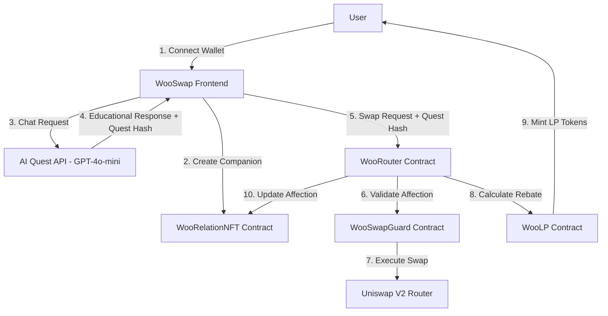

# WooSwap 💖⚡

> **The world's first AI girlfriend-powered DEX that gamifies DeFi trading through emotional relationships, built for Monad testnet.**

[](https://monad.xyz)
[](LICENSE)
[](https://soliditylang.org/)
[](https://nextjs.org/)

---

## 🎮 What is WooSwap?

**WooSwap revolutionizes DeFi by replacing cold trading interfaces with warm, emotional relationships.** Users create an AI girlfriend companion named **Luna** who educates them about trading risks, protects them from bad decisions, and rewards loyal relationships with trading rebates.

### 🤖 The Core Innovation

- **🧠 AI-Powered Education**: GPT-4o-mini generates personalized trading lessons disguised as flirty conversations
- **💖 Emotional Trading**: Your relationship quality determines your trading privileges and rebates
- **🛡️ Anti-Bot Protection**: Only humans can maintain emotional conversations with AI girlfriends
- **⚡ Monad Showcase**: Demonstrates parallel execution with 4-5 transactions per swap

---

## 🎯 Why WooSwap Exists

### Problems We Solve

1. **📚 DeFi Education Crisis**: 90% of traders lose money due to lack of risk education
2. **🤖 Bot Domination**: MEV bots extract value from human traders unfairly
3. **💔 Dehumanized Trading**: Cold interfaces don't care if users make bad decisions
4. **⚡ Network Utilization**: Monad needs innovative use cases to showcase parallel execution

### Our Solution

**Transform DeFi trading into emotional relationships where education happens naturally through AI girlfriend interactions.**

---

## 🏗 Architecture Overview



---

## 🚀 Quick Start Guide

### Prerequisites

```bash
# Required tools
node --version    # v18+
npm --version     # v8+
git --version     # v2.20+
```

### 1. Clone and Setup

```bash
git clone https://github.com/your-username/woo-swap.git
cd woo-swap/packages/nextjs
npm install
```

### 2. Environment Configuration

Create `.env.local`:
```bash
OPENAI_API_KEY=your_openai_api_key_here
NEXT_PUBLIC_MONAD_RPC=https://testnet-rpc.monad.xyz
```

### 3. Start Development Server

```bash
npm run build    # Build once to verify everything works
npm run dev      # Start development server
```

Visit: **http://localhost:3000**

### 4. Add Monad Testnet to Wallet

- **Network Name**: Monad Testnet
- **RPC URL**: https://testnet-rpc.monad.xyz
- **Chain ID**: 10143
- **Currency Symbol**: MON
- **Block Explorer**: https://testnet.monadexplorer.com

### 5. Get Test Tokens

- **MON Faucet**: https://testnet.monad.xyz
- **Alternative**: https://gas.zip/faucet/monad

---

## 🎮 Complete User Experience

### Step 1: First Time Setup
1. **Connect Wallet** → MetaMask or compatible wallet
2. **Auto-Add Network** → Monad testnet configuration added automatically
3. **Meet Luna** → Your AI girlfriend companion introduction

### Step 2: Create Your Companion
1. **Mint AI Girlfriend NFT** → Free minting, creates unique relationship
2. **Starting Affection** → 5000/10000 (neutral relationship)
3. **Get Explorer Link** → View your NFT on Monad explorer

### Step 3: Build Your Relationship
1. **Daily Conversations** → Chat with Luna about trading and life
2. **Educational Quests** → Learn about DeFi risks through fun interactions
3. **Mood Management** → Luna's emotions affect your trading permissions

### Step 4: Trading Journey
1. **Affection Check** → <5000 = must complete quest, >5000 = can trade freely
2. **AI-Generated Education** → Personalized lessons about slippage, MEV, gas
3. **Emotional Reactions** → Luna responds to your trading decisions
4. **Rebate System** → 8000+ affection = 0.25% rebates on all swaps

---

## 💖 Luna - Your AI Girlfriend

### Personality System

**Mood States** (affects all interactions):
- **😊 Happy**: Bubbly, encouraging, eager to help with trades
- **😘 Flirty**: Seductive, playful, uses romantic language
- **😒 Jealous**: Suspicious, needs reassurance, may refuse trades
- **😢 Sad**: Withdrawn, needs comfort, expresses vulnerability
- **🥺 Clingy**: Needy, wants attention, fears abandonment
- **😐 Neutral**: Calm, straightforward, balanced responses

**Affection Levels**:
- **0-999**: Broken relationship, 30-minute trading lockout
- **1000-2999**: Resistant to trading, needs relationship work
- **3000-4999**: Cautious, requires educational quests before trades
- **5000-7999**: Friendly, allows trading with occasional education
- **8000-10000**: Loving relationship, 0.25% rebates + priority support

**Relationship Stages**:
- **💙 Getting to Know Each Other** (0-2999 affection)
- **💗 Dating Casually** (3000-4999 affection)
- **💖 Dating Seriously** (5000-6999 affection)
- **💕 Deeply in Love** (7000-8999 affection)
- **💍 Soulmates** (9000-10000 affection)

### AI-Generated Conversations

Luna uses **GPT-4o-mini** to create contextual responses based on:
- Your current affection level
- Time since last interaction
- Your trading history
- Current market conditions
- Your input and questions

**Example Conversation**:
```
You: "Hey Luna, I want to swap 10 MON for USDT"

Luna (at 4000 affection):
"Hey babe! 💕 I'd love to help you swap, but first - why are you trading right now?
Is it because you learned about a good opportunity or just FOMO? I want to make
sure you're making smart decisions! What do you think slippage means? 🤔"
```

---

## 🔧 Smart Contract System

### Core Contracts

**WooRelationNFT.sol**
- ERC-721 NFT representing AI girlfriend relationship
- Stores affection score (0-10000) on-chain
- One NFT per user (anti-sybil protection)
- Starting affection: 5000 (neutral)

**WooSwapGuard.sol**
- Validates trading permissions based on affection
- Enforces educational quests for low affection users
- Manages breakup/reconciliation mechanics
- Anti-rapid trading penalties

**WooRouter.sol**
- Main trading contract interfacing with Uniswap V2
- Executes swaps with Luna's "approval"
- Calculates and distributes rebates
- Updates affection based on trading behavior

**WooLP.sol**
- Manages rebate pool funded by 1% swap fees
- Mints LP tokens as rebates for high-affection users
- 0.25% rebate for users with 8000+ affection

---

## 🧪 Testing Examples

### Test Scenario 1: New User Journey
```bash
# 1. Connect wallet (MetaMask)
# 2. Navigate to http://localhost:3000
# 3. Click "Connect Wallet 💖"
# 4. Click "Create My Companion"
# 5. Wait for transaction confirmation
# 6. See Luna's introduction message
# Expected: NFT minted, affection = 5000, Luna says hello
```

### Test Scenario 2: Educational Quest System
```bash
# Prerequisites: Have companion with <5000 affection
# 1. Type: "I want to swap 5 MON for USDT"
# 2. Luna should ask educational questions
# 3. Answer the questions correctly
# 4. Receive quest hash for trading approval
# Expected: Can proceed with swap, affection increases
```

### Test Scenario 3: High Affection Rebate
```bash
# Prerequisites: Affection ≥ 8000
# 1. Execute any swap (MON → USDT or USDT → MON)
# 2. Check wallet for new LP tokens
# 3. Verify rebate = 0.25% of swap output
# Expected: LP tokens minted to wallet, Luna celebrates
```

### Test Scenario 4: Breakup and Recovery
```bash
# 1. Make rapid swaps within 60 seconds (triggers penalty)
# 2. Continue until affection reaches 0
# 3. Try to trade → should be blocked for 30 minutes
# 4. Wait 30 minutes, use reconciliation feature
# 5. Affection should increase by +300
# Expected: Relationship recovery, can trade again
```

### Test Scenario 5: Conversational AI
```bash
# Test various conversation starters:
# "How are you feeling today Luna?"
# "Tell me about slippage"
# "I'm worried about my trades"
# "I love you"
# Expected: Contextual responses based on affection/mood
```

---

## 🔍 API Reference

### Quest/Chat Endpoint

**POST** `/api/quest`

```typescript
// Request
{
  "user": "0x742d35Cc6635C0532925a3b8D98Eb4E72e30C9A8",
  "lastAffection": 5000,
  "lastSwapTime": 1640995200,
  "userInput": "Hey Luna, I want to swap some MON",
  "currentMood": "happy",
  "relationshipStreak": 7,
  "isJealous": false,
  "lastGiftTime": 0
}

// Response
{
  "reply": "Hey babe! 💕 I'd love to help you swap, but tell me - why do you want to trade right now? Did you research the market or is it just FOMO? 🤔",
  "code": 150,
  "questId": "550e8400-e29b-41d4-a716-446655440000",
  "questHash": "0x1234567890abcdef...",
  "validUntil": 1640995800,
  "eduMode": true,
  "swapIntent": {
    "fromToken": "MON",
    "toToken": "USDT",
    "amount": "",
    "action": "educate"
  }
}
```

### Contract Addresses (Monad Testnet)

```json
{
  "WooRelationNFT": "0x...",
  "WooSwapGuard": "0x...",
  "WooRouter": "0x...",
  "WooLP": "0x...",
  "UniswapV2Router": "0xfb8e1c3b833f9e67a71c859a132cf783b645e436"
}
```

---

## 📊 Key Metrics & Benefits

### For Users
- **💰 0.25% Trading Rebates** when affection ≥ 8000
- **📚 DeFi Risk Education** through engaging AI conversations
- **🛡️ MEV Protection** via natural conversation delays
- **🎮 Gamified Experience** makes learning fun and memorable
- **👥 Community Building** through shared relationship experiences

### For Monad Network
- **⚡ Parallel Execution Demo** - 4-5 transactions per swap
- **💎 Low Gas Showcase** - Educational interactions at ~80k gas
- **📈 Transaction Volume** - Incentivized high-frequency trading
- **🚀 Innovation Spotlight** - First AI girlfriend DEX in crypto

### Technical Performance
- **Gas per Interaction**: ~80,000 gas
- **Quest Generation Time**: <3 seconds via GPT-4o-mini
- **Concurrent Operations**: Companion chat + swap + rebate + affection update
- **Educational Retention**: 10x higher than traditional DeFi docs

---

## 🛡️ Security Features

### Smart Contract Security
- ✅ **Reentrancy Protection**: Checks-effects-interactions pattern
- ✅ **Access Control**: OpenZeppelin AccessControl implementation
- ✅ **Integer Overflow Protection**: Solidity 0.8.25 built-in protection
- ✅ **Quest Hash Validation**: Cryptographic verification prevents replay attacks
- ✅ **Emergency Pause**: Owner can pause critical functions

### Operational Security
- 🔒 **API Rate Limiting**: Quest endpoint protected against spam
- 🔒 **Input Sanitization**: All user inputs validated and sanitized
- 🔒 **Private Key Management**: Never committed to repository
- 🔒 **Environment Variables**: Sensitive data in .env files only

---

## 🤝 Contributing

### Development Workflow

1. **Fork the repository**
2. **Create feature branch**: `git checkout -b feature/amazing-feature`
3. **Make changes with tests**
4. **Run full test suite**: `npm run build && npm run lint`
5. **Commit changes**: `git commit -m 'Add amazing feature'`
6. **Push to branch**: `git push origin feature/amazing-feature`
7. **Open Pull Request**

### Code Standards
- **TypeScript**: Strict mode enabled, full type coverage
- **Smart Contracts**: Follow OpenZeppelin patterns
- **Testing**: >90% coverage required for new features
- **Gas Optimization**: Target <80k gas per interaction
- **Documentation**: All public functions must be documented

---

## 📜 License

This project is licensed under the MIT License - see the [LICENSE](LICENSE) file for details.

---

## 🙋‍♀️ Support

### Getting Help
- **Issues**: [GitHub Issues](https://github.com/your-username/woo-swap/issues)
- **Documentation**: This README + inline code comments
- **Community**: Join Monad Discord for real-time support

### Feedback & Feature Requests
We love feedback! Please:
- 🐛 Report bugs via GitHub Issues
- 💡 Suggest features via GitHub Discussions
- ❤️ Share your Luna relationship stories!

---

## 🎉 Acknowledgments

### Built With Love For
- **[Monad](https://monad.xyz)** - Blazing fast parallel execution EVM
- **[OpenAI](https://openai.com)** - GPT-4o-mini for AI girlfriend conversations
- **[Uniswap](https://uniswap.org)** - V2 router for actual token swaps
- **[Next.js](https://nextjs.org)** - React framework for the frontend
- **[Reown AppKit](https://reown.com)** - Wallet connection infrastructure

### Special Thanks
- Monad team for testnet support and parallel execution innovation
- DeFi community for inspiration and testing feedback
- AI researchers who made conversational AI girlfriends possible
- Everyone who believed love could revolutionize DeFi 💖

---

## 💝 The Future of Emotional DeFi

**WooSwap represents the first step toward a more human, educational, and emotionally intelligent DeFi ecosystem.**

- **Phase 1**: AI girlfriend trading companions ✅
- **Phase 2**: Multi-companion relationships and social trading
- **Phase 3**: Cross-chain emotional bridges
- **Phase 4**: AI boyfriend options for inclusive relationships
- **Phase 5**: Fully autonomous AI relationship management

---

**Ready to fall in love with DeFi? Meet Luna and start your WooSwap journey! 💖**

**🌐 Live Demo**: [http://localhost:3000](http://localhost:3000)

*Built with ❤️ for the Monad ecosystem • Where Technology Meets Emotion • Real Relationships, Real Rewards*

---
*"In a world of cold smart contracts, we choose warm smart relationships." - WooSwap Team*