# WooSwap 💖⚡

> **The world's first gamified DEX where you build a relationship with an AI companion to unlock better trading deals.**

[](https://monad.xyz)
[](LICENSE)
[](https://soliditylang.org/)

## 🎮 What is WooSwap?

WooSwap is an over-engineered swap dApp that gamifies DeFi trading through AI companion relationships. Users "woo" a neutral AI Wallet Companion via quick chats to build an on-chain affection score, unlocking swap rebates and educational content.

**Think Tamagotchi meets Uniswap, powered by Monad's parallel execution.**

### 🎯 For Users
- **💰 Savings**: 0.25% rebates on swaps (2-4% APR for active traders)
- **📚 Education**: Learn DeFi risks through fun AI conversations
- **🤖 Anti-Bot**: Gamification creates fair, human-first trading

### ⚡ For Monad
- **Parallel Testing**: 4-5 transactions per swap showcase parallel execution
- **Low Gas**: Micro-interactions at ~80k gas each
- **Volume Generation**: Incentivized trading for network stress testing

---

## 🏗 Architecture


---

## 🚀 Quick Start

### Prerequisites
- Node.js 18+ and Yarn
- Foundry (forge, cast, anvil)
- MetaMask or compatible wallet
- OpenAI API key (for quest generation)

### 1. Setup Environment
```bash
# Clone and setup
./setup.sh

# Fill in your keys
vim .env
# PRIVATE_KEY=your_wallet_private_key
# OPENAI_API_KEY=your_openai_key
```

### 2. Add Monad Testnet to Wallet

**Manual Setup:**
- **Network Name**: Monad Testnet
- **RPC URL**: https://testnet-rpc.monad.xyz
- **Chain ID**: 10143
- **Currency Symbol**: MON
- **Block Explorer**: https://testnet.monadexplorer.com

**Or use ChainList.org for auto-add**

### 3. Get Testnet Tokens
- **MON Faucet**: https://testnet.monad.xyz
- **Alternative**: https://gas.zip/faucet/monad
- **USDT**: DM Monad team or use faucet contracts

### 4. Deploy Contracts
```bash
# Deploy to Monad testnet
./deploy.sh

# Check deployment addresses
cat deployments/monad-testnet.json
```

### 5. Start Frontend
```bash
cd packages/nextjs
yarn install
yarn dev
# Visit http://localhost:3000
```

### 6. Start Indexer (Optional)
```bash
cd indexer
# Update config.yaml with deployed addresses
docker-compose up -d
# GraphQL endpoint: http://localhost:8080/graphql
```

---

## 🎯 How It Works

### The Relationship Journey

```mermaid
stateDiagram-v2
    [*] --> Single
    Single --> Dating: Mint NFT
    Dating --> HighAffection: Complete Quests + Gifts
    Dating --> LowAffection: Ignore Education
    LowAffection --> Breakup: Affection = 0
    HighAffection --> Rebates: Affection ≥ 8000
    Breakup --> Reconcile: Wait 30min + Tweet
    Reconcile --> Dating: +300 Affection
```


### Quest System
1. **User wants to swap** → Frontend checks affection
2. **If affection < 5000** → Must complete quest
3. **AI generates quest** → Educational + fun (e.g., "Why swap now? A: Learn risks B: FOMO C: Strategy")
4. **User answers** → Gets quest hash for on-chain verification
5. **Swap executes** → Affection increases based on educational engagement

### Rebate Mechanism
- **Fee Collection**: 1% of swap volume → pool
- **Rebate Eligibility**: Affection ≥ 8000 = 0.25% rebate
- **Payment**: Minted as LP tokens to user's wallet
- **APR**: ~2-4% for active high-affection traders

---

## 🛠 Development

### Smart Contracts
```bash
# Install dependencies
forge install

# Compile contracts
forge build --sizes

# Run tests
forge test -vvv

# Deploy locally
anvil
forge script script/DeployWoo.s.sol --broadcast --rpc-url http://localhost:8545
```

### Frontend Development
```bash
cd packages/nextjs
yarn dev        # Start dev server
yarn build      # Production build
yarn lint       # Lint code
yarn type-check # TypeScript check
```

### Testing
```bash
# Smart contract tests
forge test --match-test testWoo

# Generate demo data
forge script script/DemoData.s.sol --broadcast --rpc-url $MONAD_RPC

# Frontend tests (if implemented)
cd packages/nextjs && yarn test
```

---

## 📋 Contract Addresses

### Monad Testnet (Chain ID: 10143)
```json
{
  "nft": "0x...",
  "guard": "0x...",
  "lp": "0x...",
  "router": "0x...",
  "uniswapRouter": "0xfb8e1c3b833f9e67a71c859a132cf783b645e436"
}
```
*Addresses populated after deployment*

---

## 🎮 User Guide

### First-Time Users
1. **Connect Wallet** → Auto-adds Monad chain
2. **Mint Relationship NFT** → Free mint, starts at 5000 affection
3. **Complete First Quest** → AI asks educational questions
4. **Execute Swap** → MON → USDT through Uniswap V2
5. **Send Gift** (Optional) → 1 MON = +100 affection

### Advanced Features
- **Educational Mode**: Every quest explains DeFi risks (slippage, MEV, etc.)
- **Rapid Swap Penalty**: <60s between swaps = -500 affection
- **Breakup Recovery**: Reconcile every 24h for +300 affection
- **Social Features**: Breakup tweets for accountability

### Troubleshooting
| Issue | Solution |
|-------|----------|
| Gas errors | Set gas price to 50 gwei manually |
| Quest API fails | Uses fallback hardcoded quests |
| Wallet connection | Add Monad chain manually via settings |
| Low affection | Complete quests or send gifts |
| Breakup cooldown | Wait 30 minutes, then reconcile |

---

## 🔧 API Reference

### Quest API Endpoint
```typescript
POST /api/quest
{
  "user": "0x...",
  "lastAffection": 5000,
  "lastSwapTime": 1640995200,
  "userInput": "optional chat message"
}

Response:
{
  "reply": "Why swap now? A: Learn B: Fun C: Risky 🤔",
  "code": 200,
  "questId": "uuid-v4",
  "questHash": "0x...",
  "validUntil": 1640995800,
  "eduMode": true
}
```

### GraphQL Queries (Indexer)
```graphql
query TopUsers {
  topUsers(limit: 10) {
    address
    totalVolume
    swapCount
    currentAffection
    totalRebates
  }
}

query UserStats($address: String!) {
  userStats(address: $address) {
    totalVolume
    currentAffection
    breakupCount
  }
}
```

---

## 📈 Analytics & Monitoring

### Key Metrics
- **Gas per swap**: Target <80k gas
- **Parallel transactions**: 4-5 per swap
- **User retention**: Measured via affection scores
- **Educational impact**: Quest completion rates

### Monitoring Endpoints
- **Health check**: http://localhost:8081/health
- **Metrics**: http://localhost:9090/metrics
- **GraphQL**: http://localhost:8080/graphql
- **Redis UI**: http://localhost:8082

---

## 🧪 Demo Scenarios

Run the demo script to generate test data:
```bash
forge script script/DemoData.s.sol --rpc-url $MONAD_RPC --broadcast
```

### Demo Users
1. **Alice** (Success): High affection → rebates earned
2. **Bob** (Education): Moderate engagement, learning bonuses
3. **Charlie** (Breakup): Rapid swapping → penalties → reconciliation

### Expected Results
- **Total swaps**: 5
- **Average gas**: ~80k per swap
- **Rebate demonstration**: Alice receives 0.25% back
- **Social proof**: Charlie's breakup tweeted

---

## 🛡 Security Considerations

### Smart Contract Security
- ✅ **Reentrancy protection**: Checks-effects-interactions pattern
- ✅ **Integer overflow**: Solidity 0.8.25 built-in protection
- ✅ **Access control**: OpenZeppelin AccessControl
- ✅ **Gas optimization**: <24kB contract size limit
- ✅ **Emergency stops**: Owner can pause critical functions

### Operational Security
- 🔒 **Private keys**: Never commit to repository
- 🔒 **API keys**: Environment variables only
- 🔒 **Quest validation**: On-chain hash verification
- 🔒 **Rate limiting**: Built into quest API
- 🔒 **Input sanitization**: All user inputs validated

---

## 🌍 Deployment Guide

### Local Development
```bash
# Start local blockchain
anvil

# Deploy contracts
forge script script/DeployWoo.s.sol --broadcast --rpc-url http://localhost:8545

# Start services
yarn chain & yarn start & docker-compose up -d
```

### Testnet Deployment
```bash
# Set environment
export PRIVATE_KEY="your_key"
export MONAD_RPC="https://testnet-rpc.monad.xyz"

# Deploy
./deploy.sh

# Verify contracts
forge verify-contract $CONTRACT_ADDRESS src/Contract.sol:Contract \
  --verifier sourcify \
  --verifier-url https://sourcify-api-monad.blockvision.org \
  --rpc-url $MONAD_RPC
```

### Production Checklist
- [ ] Contract addresses updated in frontend
- [ ] Indexer config updated with addresses
- [ ] Environment variables set
- [ ] Domain configured for frontend
- [ ] Monitoring alerts configured
- [ ] Twitter API credentials set
- [ ] SSL certificates installed

---

## 🤝 Contributing

### Development Workflow
1. Fork the repository
2. Create feature branch (`git checkout -b feature/amazing-feature`)
3. Make changes with tests
4. Run full test suite (`forge test && yarn test`)
5. Commit changes (`git commit -m 'Add amazing feature'`)
6. Push to branch (`git push origin feature/amazing-feature`)
7. Open Pull Request

### Code Standards
- **Solidity**: Follow OpenZeppelin patterns
- **TypeScript**: Strict mode enabled
- **Testing**: >90% coverage required
- **Documentation**: All public functions documented
- **Gas**: Optimize for <80k per transaction

---

## 📜 License

This project is licensed under the MIT License - see the [LICENSE](LICENSE) file for details.

---

## 🙋 Support & Community

### Getting Help
- **Issues**: [GitHub Issues](https://github.com/anthropics/claude-code/issues)
- **Documentation**: This README + inline code comments
- **Discord**: Join Monad community for real-time help

### Feedback
We love feedback! Please:
- Report bugs via GitHub Issues
- Suggest features via GitHub Discussions
- Share your WooSwap relationship stories!

---

## 🎉 Acknowledgments

### Built With Love For
- **[Monad](https://monad.xyz)**: Blazing fast parallel execution
- **[OpenAI](https://openai.com)**: GPT-4o-mini for quest generation
- **[Uniswap](https://uniswap.org)**: V2 router integration
- **[Scaffold-ETH 2](https://scaffoldeth.io)**: Development framework
- **[Envio](https://envio.dev)**: Blockchain indexing

### Special Thanks
- Monad team for testnet support
- DeFi community for inspiration
- Everyone who helped test and provide feedback

---

**Ready to fall in love with DeFi? Let's Woo! 💖**

*Built with ❤️ for the Monad ecosystem*